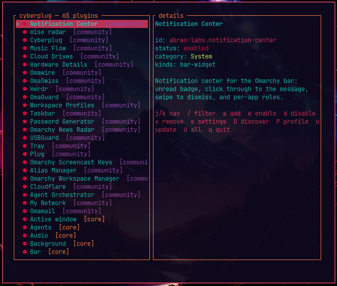

# ⚡ cyberplug

Terminal plugin manager for Omarchy's Quattro shell — discover, install, enable,
configure, and profile your plugins without leaving the keyboard.

Ships as an Omarchy bar widget. One command installs the widget **and** the
manager binary.



[](https://github.com/cybercore-tech/cyberplug/actions/workflows/ci.yml)
[](https://github.com/cybercore-tech/cyberplug/actions/workflows/release-binary.yml)
[](LICENSE)

## 📦 Install

```bash
omarchy plugin add https://github.com/cybercore-tech/cyberplug.git --enable
```

Click the plug icon on the bar. The first click builds this same checkout's
source with `cargo build --locked` (needs Rust — see [Requirements](#requirements)),
caching the resulting binary under `bin/<arch>/` so every click after that is
instant. It never downloads or executes a prebuilt artifact from the network.

## 🗑️ Remove

```bash
omarchy plugin remove io.github.darkstardevx.cyberplug
```

## 🎛️ Use

```bash
cyberplug              # optional: run the TUI from any terminal (see Developer install below)
cyberplug --discover   # jump straight to the Discover screen instead of the main list
```

Or just use the bar icon. Inside the TUI:

### 🖥️ Main screen

```
j/k, ↑/↓    move
/           filter installed plugins
a           add plugin by git url
e           enable (pick placement: left, center, right)
d           disable
x           remove (confirms)
s           settings (if the plugin has any)
Shift+D     discover — browse the community registry
P           profile — export or import your whole setup
u           update selected
U           update all
q, Esc      quit
```

> **Note:** `Shift+D` (capital `D`) opens Discover. Plain `d` is a different,
> nearby key that disables the selected plugin — mind the Shift.

### 🔎 Discover screen

Press **`Shift+D`** from the main screen (or launch straight into it with
`cyberplug --discover`, see below) to browse the live community registry from
[plugins.omarchy.org](https://plugins.omarchy.org) without leaving the
keyboard:

```
j/k, ↑/↓    move through results
h/l, ←/→    switch category tab (All, Appearance, Desktop, …)
ENTER       install the selected plugin — then walks into placement
r           force-refresh the registry (bypass the local cache)
q, Esc      back to the main screen
```

The registry is cached locally, so Discover still opens (from cache) when
you're offline; `r` re-fetches it.

#### 🚀 Start directly on Discover

If you'd rather skip the main screen and land straight in Discover — say,
you're mostly here to browse for new plugins — pass `--discover` (aliases:
`--discovery`, `-d`) on launch:

```bash
cyberplug --discover
```

This only changes which screen you land on; every keybinding above still
works the same once you're there, and `Esc`/`q` still takes you back to the
normal main screen (it doesn't quit). Leaving the flag off keeps today's
default: cyberplug always opens on the main plugin list.

## 🔌 What it wraps

Every action shells out to the real `omarchy plugin` CLI. cyberplug reads
`omarchy plugin catalog` and calls `enable` / `disable` / `add` / `remove` /
`update` for state changes.

## 🛠️ Developer install (CLI use outside the bar)

```bash
git clone https://github.com/cybercore-tech/cyberplug.git
cd cyberplug
./install.sh --local-bin
```

That builds a release binary and installs it to `~/.local/bin/cyberplug`.
The bar widget doesn't need this — it builds and caches its own binary
under `bin/<arch>/` on first click.

## 🧠 Profiles and settings

Press **`P`** in the main screen to export or import a complete setup profile.
The default profile path is `~/.config/cyberplug/profile.json`; plugin-specific
settings are stored under `~/.config/cyberplug/settings.json`.

Import restores installed, enabled, disabled, and saved plugin settings. Export
creates a portable JSON snapshot you can keep with your workstation backups.

## 📚 Docs

- [docs/ARCHITECTURE.md](docs/ARCHITECTURE.md)
- [docs/SETTINGS.md](docs/SETTINGS.md)
- [docs/CONTRIBUTING.md](docs/CONTRIBUTING.md)
- [SECURITY.md](SECURITY.md) — how to report a vulnerability
- [STATEMENT.md](STATEMENT.md) — how this project is built, AI's role in it

## ✅ Requirements

Omarchy with the Quattro shell, and `cargo`/Rust installed once to build this
checkout's own source on first launch (cached after that — see
[Install](#install)). Discover needs network (falls back to the last cached
registry).

## ⚖️ License

MIT
